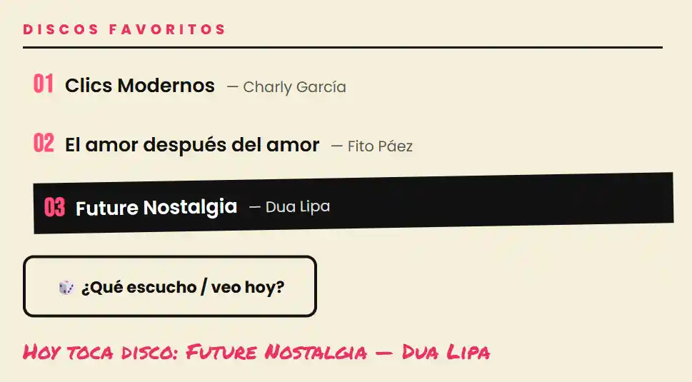
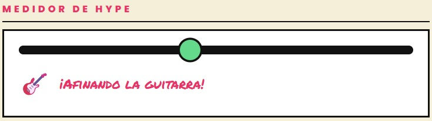
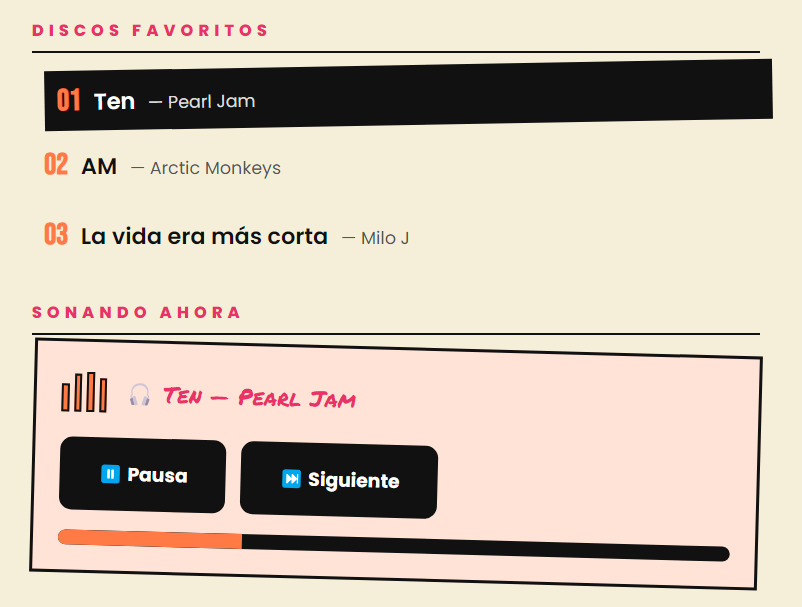
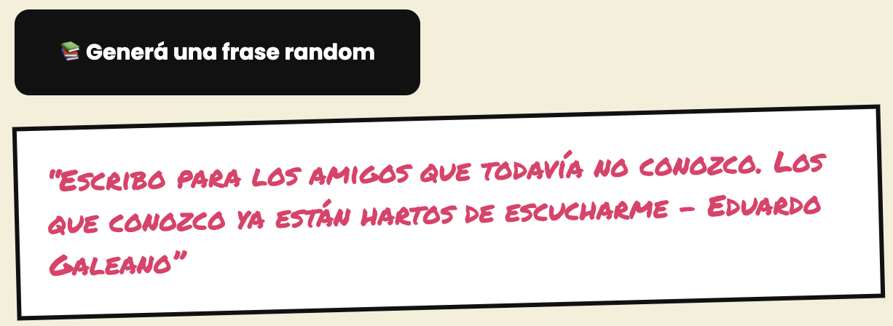

# ϟ WebFest 2026 — Grupo 13

> Trabajo Práctico Grupal 1 · Desarrollo de Sistemas Web (Front End) · 2026, 2do cuatrimestre

**WebFest 2026** es el sitio web del Grupo 13, pensado como el afiche de un festival de música. Cada integrante del equipo es un "artista" del **line up**: la portada presenta al grupo y cada tarjeta lleva a su página de perfil. La **bitácora** se diseñó como un "World Tour": cada reunión o avance del proyecto tiene su propio ticket de concierto, con fecha, sede y talón.

**Propósito del equipo:** aprender a construir un sitio en equipo con HTML, CSS y JavaScript, repartiendo tareas, versionando con Git y documentando cada decisión.

🔗 **Sitio publicado en Vercel:** https://tp-1-front-grupo13.vercel.app

📁 **Repositorio:** https://github.com/celina-web/TP1_Front_Grupo13

---

## 📑 Índice

1. [Integrantes](#-integrantes)
2. [Tecnologías](#️-tecnologías-utilizadas)
3. [Estructura de archivos](#-estructura-de-archivos-y-carpetas)
4. [Guía de estilos](#-guía-de-estilos)
5. [Diseño adaptable](#-diseño-adaptable-breakpoints)
6. [Funciones JavaScript](#-funciones-javascript)
7. [Bitácora](#-bitácora)
8. [Uso de IA](#-uso-de-inteligencia-artificial)
9. [Evolución](#-evolución-del-proyecto)

---

## 👥 Integrantes

| # | Integrante | Perfil en el sitio | GitHub |
|---|------------|--------------------|--------|
| 01 | Sebastián | [sebastian.html](sebastian.html) | [@DevJaSeb](https://github.com/DevJaSeb) |
| 02 | Valentina | [valentina.html](valentina.html) | [@ValentinaBS](https://github.com/ValentinaBS) |
| 03 | Agustín | [agustin.html](agustin.html) | [@aguscp](https://github.com/aguscp) |
| 04 | Celina | [celina.html](celina.html) | [@celina-web](https://github.com/celina-web) |

---

## 🛠️ Tecnologías utilizadas

- **HTML5** semántico (`header`, `nav`, `main`, `section`, `article`, `dl`, `figure`).
- **CSS3** propio: Flexbox, Grid, variables CSS (custom properties), `clip-path`, transformaciones 3D y media queries.
- **JavaScript** vanilla (sin librerías): eventos, manipulación del DOM, `IntersectionObserver` y transiciones entre páginas.
- **Google Fonts**: Bebas Neue, Permanent Marker y Poppins.
- **Git + GitHub** para el trabajo colaborativo (una rama por integrante).
- **Vercel** para la publicación.

---

## 📂 Estructura de archivos y carpetas

```
TP1_Front_Grupo13/
├── index.html          # Portada: nombre, propósito y line up con los 4 integrantes
├── sebastian.html      # Perfil de Sebastián
├── valentina.html      # Perfil de Valentina
├── agustin.html        # Perfil de Agustín
├── celina.html         # Perfil de Celina
├── bitacora.html       # Bitácora del proceso ("World Tour")
├── css/
│   ├── base.css       # Estilos globales: navbar, portada, cards y footer.
│   ├── perfil.css     # Layout compartido de los perfiles individuales
│   ├── bitácora.css   # Layout bitácora, store.
│   ├── sebastian.css  # Estilos del perfil de Sebastian.
│   ├── celina.css     # Estilos del perfil de Celina.
│   └── agustin.css    # Estilos del reproductor del perfil de Agustín.
├── js/
│   ├── main.js         # Menú hamburguesa, flip de cards y animaciones de scroll
│   ├── bitacora.js     # Interacción del pase "Una más" de la bitácora.
│   ├── valentina.js    # Función dinámica del perfil de Valentina
│   ├── sebas.js        # Función dinámica del perfil de Sebas
│   ├── celina.js       # Función dinámica del perfil de Celina
│   └── agustin.js      # Función dinámica del perfil de Agustín
├── img/                # Fotos, avatares e imágenes del sitio
└── README.md
```

---

## 🎨 Guía de estilos

### Paleta de colores

| Muestra | Hex | Uso |
|---------|-----|-----|
|  | `#F5EFD9` | Fondo general (papel de afiche) |
|  | `#111111` | Texto, bordes y botones |
|  | `#65D98B` | Card de Sebas |
|  | `#FF4F81` | Card y perfil de Valen |
|  | `#FF7A45` | Card y perfil de Agus |
|  | `#FFE3D6` | Fondo del reproductor de Agus |
|  | `#FFD447` | Card de Celi |
|  | `#E83268` | Acentos: subtítulos, comentarios de bitácora, hover |
|  | `#FF7A18` | Hover de los enlaces del menú |
|  | `#E32F2F` | Subrayado del enlace activo |

### Tipografías (Google Fonts)

| Fuente | Uso |
|--------|-----|
| [Permanent Marker](https://fonts.google.com/specimen/Permanent+Marker) | Títulos grandes y nombres de artistas (estilo marcador) |
| [Bebas Neue](https://fonts.google.com/specimen/Bebas+Neue) | Logo, año, números de las cards y fechas de la gira |
| [Poppins](https://fonts.google.com/specimen/Poppins) (400–800) | Texto general, menú y botones |

### Iconografía y recursos visuales

- **ϟ** rayo tipográfico como ícono del festival.
- **Manchas de pintura** hechas con `clip-path` (rosa y verde) en la portada.
- **Fotos a color enmarcadas** con el color de cada artista y borde negro grueso, para que todas las cards y perfiles se vean uniformes.
- Leves rotaciones (`rotate(-1deg)`) que imitan afiches pegados a mano.
- Emojis puntuales como íconos de acción.

---

## 📱 Diseño adaptable (breakpoints)

| Breakpoint | Comportamiento |
|------------|----------------|
| **≥ 1200 px** | Line up en 4 columnas; perfil en 2 columnas (póster + datos). |
| **≤ 1200 px** | Se reducen los espacios entre columnas. |
| **≤ 900 px** | Line up en 2 columnas; el perfil pasa a 1 columna con el póster arriba. |
| **≤ 700 px** | Aparece el menú hamburguesa. |
| **≤ 600 px** | El footer apila su contenido y centra los enlaces. |
| **≤ 400 px** | Cards en 1 columna; datos, skills y botones del perfil a ancho completo. |

---

## ⚡ Funciones JavaScript

### Portada (`js/main.js`)

| Función | Descripción |
|---------|-------------|
| **Flip de las cards del line up** | Al hacer clic (o Enter/Espacio con el teclado) sobre una card, gira en 3D y muestra el dorso con información del artista. Sólo puede haber una card abierta a la vez. Actualiza `aria-pressed`, `aria-label` y `aria-hidden` para lectores de pantalla. |
| **Menú hamburguesa** | Debajo de 700 px el menú se colapsa en un botón. Al tocarlo se despliega con transición; se cierra al elegir un enlace o con la tecla `Esc`. |
| **Transiciones entre páginas** | Los enlaces internos muestran una transición temática; cada perfil de artista tiene un efecto de entrada propio. Respeta `prefers-reduced-motion`. |


### Animaciones (`js/main.js`)
| **Aparición al hacer scroll** | Con `IntersectionObserver`, las cards, los tickets de la bitácora y otros bloques aparecen con un fundido escalonado a medida que entran en pantalla. Respeta `prefers-reduced-motion`. |

### Bitácora (`js/bitacora.js`)
Controla la apertura y el cierre del pase "Una más".

### Perfiles

#### Valentina — Recomendador aleatorio (`js/valentina.js`)

El botón **"🎲 ¿Qué escucho / veo hoy?"** elige al azar una de las películas o discos favoritos (los lee directamente de las listas del HTML), la resalta en la lista con una animación y muestra el resultado debajo del botón (por ejemplo: *"Hoy toca disco: Clics Modernos — Charly García"*). Nunca repite la elección anterior. El mensaje está en una región `aria-live` para que también lo anuncien los lectores de pantalla.



#### Sebastián — Medidor de hype (`js/sebas.js`)

El slider **"🔥 ¿Cuánto hype hay para el show?"** cambia en vivo el mensaje y el emoji debajo a medida que lo movés, según el nivel de energía elegido (por ejemplo: *"Probando sonido... 🥱"* en los valores bajos, hasta *"¡A tocar! 🚀"* en el máximo).



#### Agustín — Reproductor de discos (`js/agustin.js`)

El botón **"▶ Play"** simula que suena uno de los discos favoritos (los lee de la lista del HTML): lo resalta en la lista, anima un ecualizador hecho con CSS y llena una barra de progreso. Cuando la barra se completa, pasa solo al siguiente disco; también se puede avanzar con **"⏭ Siguiente"** o frenar con **"⏸ Pausa"**. El disco que suena se muestra en una región `aria-live` para lectores de pantalla.



#### Celina — Generador de frases aleatorio (`js/celina.js`)

El botón **"📚 Generá una frase random"** elige al azar una frase de autores hispanos reconocidos (los lee dentro de la función celina.js), muestra el resultado debajo del botón (por ejemplo: *"Escribo para los amigos que todavía no conozco. Los que conozco ya están hartos de escucharme - Eduardo Galeano"*).



---

## 📓 Bitácora

La bitácora está en [bitacora.html](bitacora.html), accesible desde el menú principal en todas las páginas. Cada entrada se presenta como un ticket de concierto y registra una reunión del equipo con las decisiones tomadas, los problemas encontrados y cómo se resolvieron. Algunos hitos:

- **22/09** — Primera reunión: lectura de la consigna y propuestas de temática.
- **23/09** — Se elige la temática de festival de música, la paleta, las tipografías y se crea el repositorio.
- **25/09** — Estructura de archivos en la raíz, menú hamburguesa y animaciones de la portada.
- **26/09** — Flip de las cards y perfiles individuales.

---

## 🤖 Uso de Inteligencia Artificial

| Herramienta | Modelo | Plan | Para qué se usó |
|-------------|--------|------|-----------------|
| Claude Code (app de escritorio) | Claude Opus 5.5 (Anthropic) | Pago | Perfil de Valentina y README |
| Gemini | Gemini (Google) | Gratuito | Perfil de Sebastián, ideas de interactividad JS y documentación |
| DeepSeek | DeepSeek | Gratuito | Perfil de Celina,Estructuración de Index y Bitácora, Manchas de CSS, Forma de Ticket CSS, transiciones |
| Claude (claude.ai) | Claude Opus 5.5 (Anthropic) | Pago | Perfil de Agustín, reproductor JS y documentación |

**Cómo ayudó (perfil de Valentina):**
- **Código:** propuesta del layout compartido de perfiles (`css/perfil.css`), del recomendador aleatorio (`js/valentina.js`) y del ajuste en `main.js` para que el enlace "VER PERFIL" dentro de la card no dispare el giro.
- **Contenido:** redacción del README a partir de la consigna y del código existente.
- **Revisión propia:** se revisaron y probaron los cambios en el navegador en los tres breakpoints, se adaptaron los textos y se verificó que no haya errores en consola antes de hacer commit.

**Cómo ayudó (perfil de Sebastián):**
- **Código:** generación de propuestas lógicas para las interacciones del DOM (manipulación de clases CSS mediante eventos) asegurando que no se superpusieran con las funciones ya integradas por el resto del equipo.
- **Documentación:** redacción técnica y estructuración de los apartados de JavaScript y experiencia de usuario en el README.

**Cómo ayudó (perfil de Celina):**
- **Código:** Propuesta de la estructura HTML del index y de la bitácora, las manchas decorativas, la forma de ticket (bordes, recortes, pseudo-elementos) y las transiciones/animaciones en hover o cambio de vista.
- **Revisión propia:** se revisaron y probaron los cambios en el navegador en todos los tamaños, se hicieron cambios manuales de margenes y paddings que quedaron mal, ajustes propios de la temática y colores.

**Cómo ayudó (perfil de Agustin):**
- **Código:** sugerencias para la estructura del perfil, ayuda para coherencia de diseño con resto de perfiles y la lógica del reproductor.
- **Debugging:** ayuda para detectar errores al probar la interacción. Hubo un intento para pegar un iframe de spotify pero no funcionaba bien y se descarto.
- **Documentación:** apoyo para redactar la parte del README correspondiente al perfil.
- **Revisión propia:** se adaptaron los contenidos y el diseño, y se comprobó que el perfil se adapte bien a distintos tamaños en el navegador.

**Imágenes:** las fotos de los perfiles son fotos reales de mascotas (no generadas con IA), elegidas para no publicar fotos personales, como sugiere la consigna. Las fotos de la tienda "Merch" están hechas en canva con templates gratuitos.

**Experiencia previa del equipo:** *(completar)*

---

## 🚀 Evolución del proyecto

Ideas para los próximos trabajos prácticos:

- [ ] Modo oscuro ("modo noche de festival") con un botón en la navbar.
- [ ] Reproductor con fragmentos de los discos favoritos.
- [ ] Mejorar la accesibilidad (contraste, foco visible) y medir con Lighthouse.
